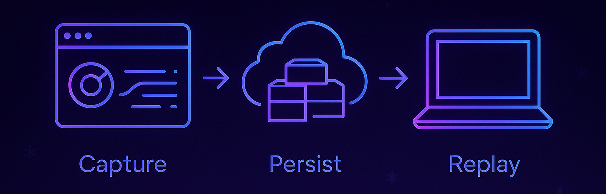
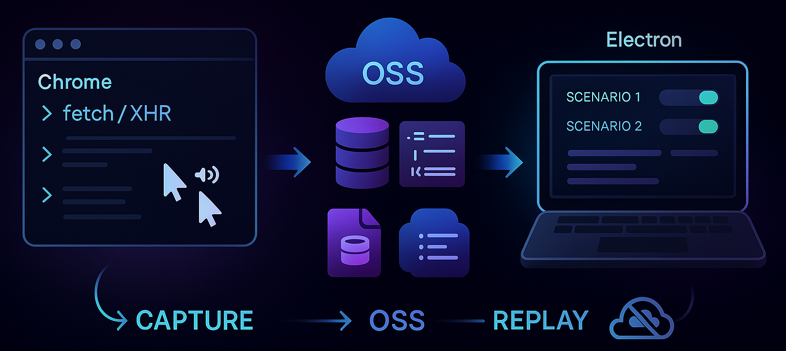

# About

> After the Winter Olympics, the organizing committee was very satisfied with the ticketing system we’d built and asked for a lightweight demo they could use for ongoing presentations and analysis. Maintaining a live, full-stack environment just for demos would have been costly and brittle, so we created two components:
>
> - a Chrome extension that snapshots product pages and their network activity, and
> - an Electron demo client that replays those snapshots offline.

# Idea

> Build a capture-and-replay pipeline:
>
> The Chrome extension listens to **fetch/XHR** requests and key UI events (click/move), intercepts responses, and packages the static assets by **API path**.
>
> The captured bundles are persisted to an object storage service (**OSS**) with simple metadata that maps each business scenario to the exact front-end state and backend responses.
>
> The Electron client acts as the demo platform: it offers an OSS sync interface and loads assets on demand, so product flows can be demonstrated without any live servers.

# Feature & Advantage

> **Cost & simplicity:** No need to keep staging/prod mirrors alive for demos.
>
> **Reliability:** Deterministic demos that don’t break due to backend changes or network issues.
>
> **Portability:** Works in venues with poor or restricted internet; everything runs **locally**.
>
> **Fidelity:** Captures real UI/UX and real API responses, preserving look, feel, and data shape.

# Release

> This is an internal project from my previous employer, so I cannot share proprietary screenshots. In short, the **plugin + client** turned a high-maintenance ticketing system into a **serverless, offline, demo-ready** application, making ongoing presentations **low-cost, stable, and easy to operate**.
