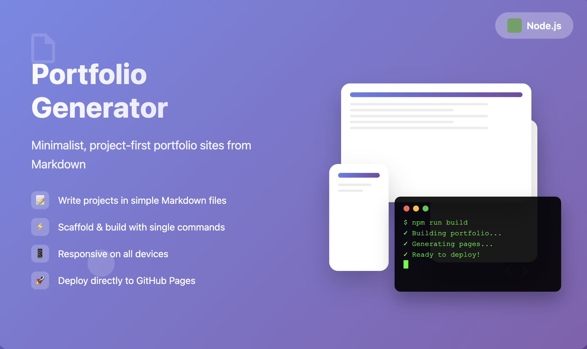
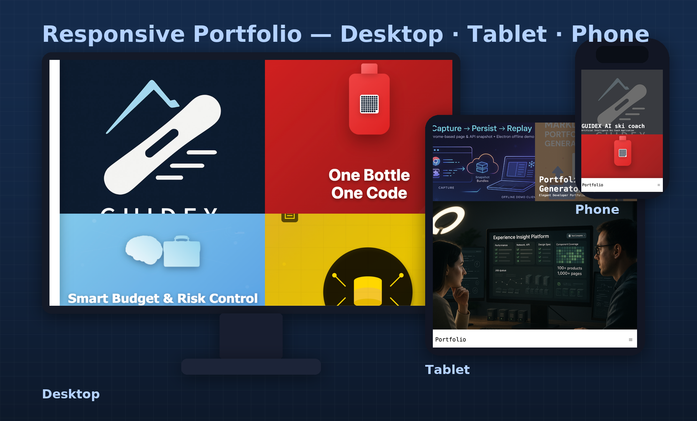

# About

> A minimalist, project-first portfolio generator built with **Node.js**. It produces a responsive site that looks great on desktop, tablet, and mobile and keeps your content in simple **Markdown**.
>
> Scaffold an initial portfolio folder in one command.
>
> Write projects as *.md files; include a lightweight about.md for a short intro.
>
> Preview locally with a dev server; build for production with a single command.
>
> Designed to publish directly to GitHub Pages (username.github.io) for quick updates and previews.

# Why do this

> Most portfolio tools ship bloated templates—long background stories, full resumes, awards grids—making the site look “full” while burying the actual projects. This tool takes the opposite approach:
>
> Hard-core, project-centric layout that surfaces problem → solution → impact.
>
> No duplicate resume fluff (that already lives in your CV/LinkedIn).
>
> Faster to author and maintain; visitors immediately see your technical depth and build details.

# Release

> Click [here](https://github.com/taobowen/Portfolio) for Source code and usage guide
