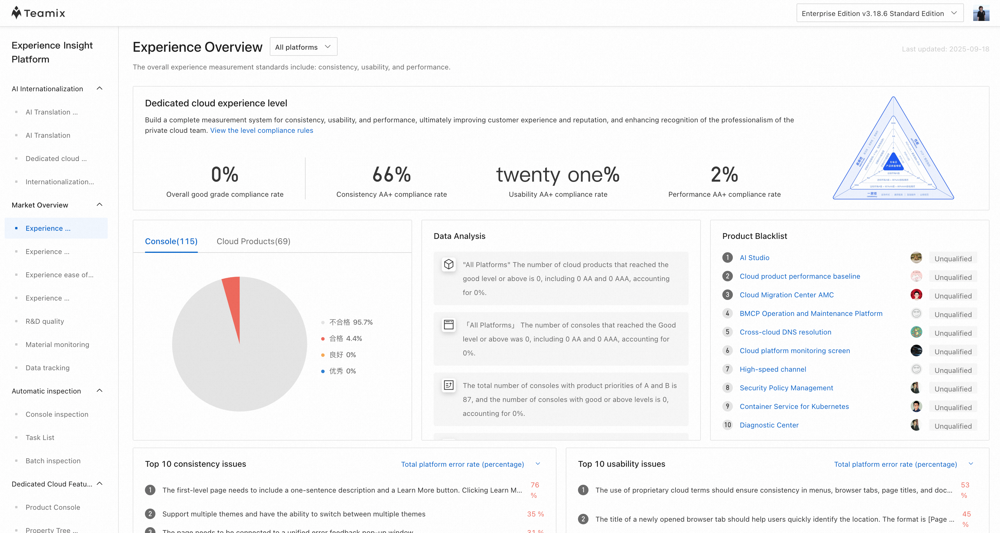

# About

> An internal platform that continuously evaluates usability and experience consistency across 100+ products and 1,000+ pages of our private-cloud management suite. It provides designers and developers with automated performance checks, network/API verification, design-spec compliance audits, and front-end component coverage reports—plus consolidated dashboards and exportable analyses.

# Why do this

> Manual walkthroughs were time-consuming and error-prone, tying up engineers and designers and still missing regressions. We needed a repeatable, accurate, low-touch way to audit large UI surfaces on a regular cadence.

# Design

> Automation engine (Node.js + Puppeteer). For each inspection item, the backend runs targeted scripts that set environment variables, mock or seed data as needed, and simulate user interactions (click, move, input) to exercise real screens and API flows.
>
> Distributed scheduler (MetaQ message queue). With only 4 VMs, a queue-driven scheduler maximizes utilization and load-balances jobs. Result: ~150% faster end-to-end runs—1,000+ pages: 20h → 8h per batch.
>
> Resource efficiency & balancing.
>
> Per-node: max CPU ↓ ~10%, min CPU ↑ ~50%; memory max/min both improved slightly (within ±5%).
>
> Cluster: CPU utilization ↑ ~20%, with near-uniform CPU/memory across nodes—effectively filling valleys and shaving peaks.
>
> Operations & observability. Master–subtask job model with real-time status, progress, and logs. Supports scheduled runs and per-task rule configuration.
>
> Notifications & self-serve. Integrated DingTalk Open API for subscription-based alerts on state changes, enabling non-engineers to launch and monitor audits via a “white-screen” (no-code) UI.

(placeholder for image)

# Release

> Sadly, This is an internal, employee-only system accessible on the company network, I can not give you the website url. To respect security policy, public materials use redrawn mockups based on the real UI rather than direct screenshots.

