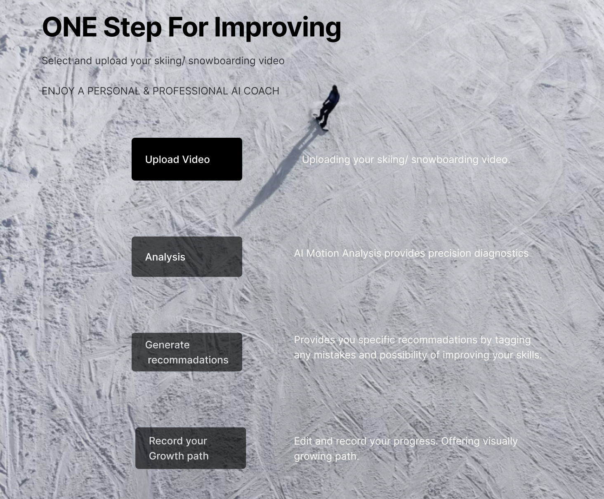

# About

> An end-to-end coaching system that analyzes user-uploaded skiing videos and returns actionable, personalized feedback. The platform combines computer vision for pose tracking, Transformers for technique classification, and an LLM with RAG for natural-language guidance. Frontends are built with React/React Native; services run on a Java backend with training on Amazon SageMaker and data stored in MySQL plus a Vector DB for retrieval.

# Tech Detail

> High-level flow:
> User video → Preprocessing → Pose Estimation → Feature Extraction → Performance Analysis → LLM (RAG) Feedback → Results
>
>
> ## Pose Estimation & Motion Tracking
>
> **Tech**: AlphaPose.
>
> **Method**: Detect shoulder/hip/knee/ankle keypoints, track motion, compute joint angles and stance metrics.
>
> **Output**: Time-series keypoint tensor + derived biomechanics features.
>
>
> ## Data Annotation & Model Training
>
> **Labels**: Instructor-curated tags (e.g., carving posture, weight shift) + rule-based auto-labels (e.g., knee angle < 90° → “insufficient knee bend”) with semi-supervised expansion.
>
> **Model**: Transformer classifier trained on pose sequences (SageMaker jobs + checkpoints).
>
> **Goal**: Detect common issues such as leaning back, late edge change, knees too straight.
>
>
> ## Performance Analysis
>
> **MVP**: Threshold rules compare user features to pro baselines (fast, explainable).
>
> **Advanced**: Multi-label Transformer outputs per-frame/per-turn error probabilities and aggregates them into session-level insights.
>
>
> ## AI-Powered Feedback Generation (RAG)
>
> **Knowledge base**: Technique guides, drills, and safety notes embedded into a Vector DB.
>
> **RAG steps**:
>
> - Map detected errors to intent queries.
>
> - Retrieve the most relevant coaching snippets.
>
> - LLM composes step-by-step advice, cues, and at-home drills tailored to the skier’s pattern.
>
> **Result**: Clear instructions like “Keep shins pressed to the tongue of the boot; target ~110° knee flexion entering the fall line.”

# Release

[Github respository](https://github.com/taobowen/Guidex_FEClick) · [Get APP](https://testflight.apple.com/join/kfbHgZCU)