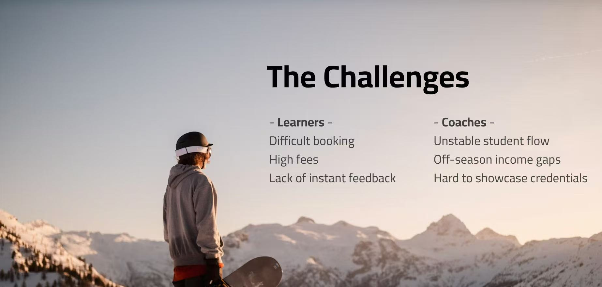

### **Background**

>Many certified coaches face challenges such as limited customer acquisition channels, lack of self-promotion, or inability to work full-time at ski resorts, which often leads to insufficient students and unstable income. In off-seasons or downtime, coaches seek online teaching models to supplement their schedules and increase revenue. Meanwhile, learners still struggle with the high cost, long booking cycles, and lack of real-time feedback in traditional coaching.

# **Why do this**
>As both a skiing enthusiast and product manager, I identified the dual-sided pain points: learners need more immediate and affordable guidance, while coaches require a more stable and scalable income stream.   To address this, I designed an AI + human hybrid coaching platform that offers membership-based access to certified coaches for learners, and provides coaches with a simple, actionable tool to deliver online lessons, showcase certifications, and monetize their expertise. This creates a sustainable two-sided value network connecting coaches and learners.

# **Actions**
>1. **User research with certified coaches** Conducted in-depth interviews with professional ski/snowboard coaches to identify unmet needs such as unstable scheduling, lack of consistent student flow, and limited income opportunities during off-season.  
>2. **Defined product vision and roadmap** Authored the PRD and scoped MVP features tailored for coaches, including qualification verification, student feedback system, and flexible scheduling tools to expand teaching opportunities.  
>3. **Bridged product and engineering** Translated coach-side business requirements (lesson scheduling, student management, income tracking) into AI product features, driving implementation with the engineering team and increasing business value in the market.  
>4. **Testing and iteration**  Oversaw beta testing with early coaches, gathered feedback on usability, refined platform features, and optimized model precision to improve adoption and monetization potential for coaches.  

### **Results**
>- Validated scalability of the model, with early beta coaches reporting higher student acquisition rates and incremental income (1200 CAD/month) opportunities during off-peak periods.  
>- Enabled new income channels for coaches by launching the first AI + human hybrid virtual coaching platform, allowing certified coaches to monetize flexible online sessions beyond seasonal or location limits.  
>- Stabilized coach scheduling and student flow, reducing idle time and increasing coach utilization through membership-based matching and flexible booking tools.  
>- Improved coach–student interaction quality with integrated feedback and rating system, enhancing trust, visibility, and long-term retention for both sides.
