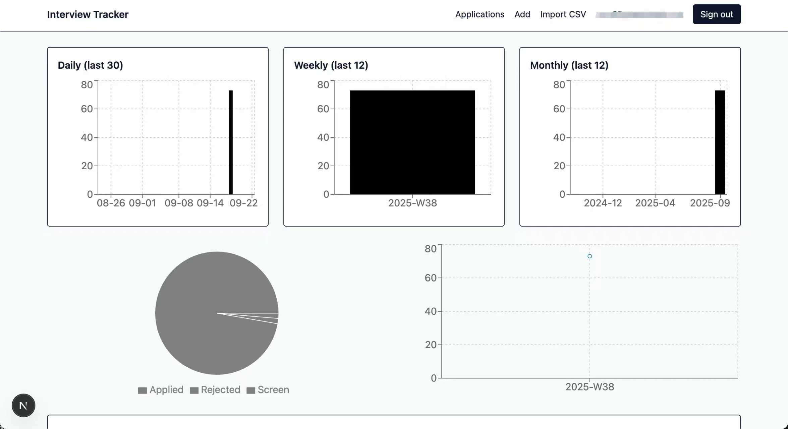
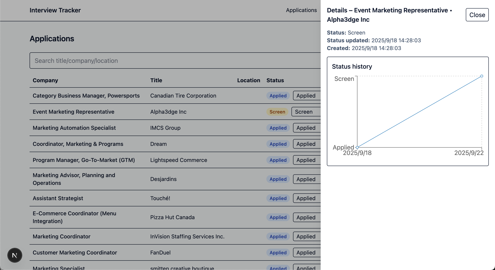
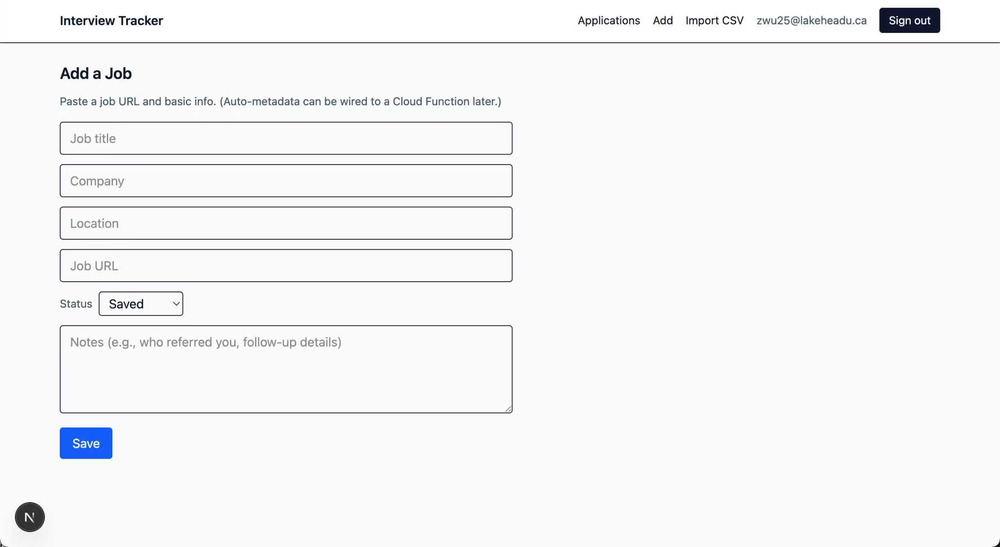

# Interview Tracker — Personal Interview Progress Platform

A focused web app that helps job‑seekers **track applications, visualize progress, and stay organized**. Built with **Next.js (App Router)**, **Tailwind**, **Firebase Auth**, and **Firestore**; charts rendered with **Recharts**.

## Why I built it

Job searches create scattered spreadsheets, sticky notes, and endless tabs. I designed Interview Tracker to consolidate everything into one clean interface: **add roles fast, update statuses in one click, and see trends instantly**. The goal was to make progress feel visible, actionable, and calm.

## Core functionality

* **Application management**

  * Add, edit, and delete roles with **title, company, location, link, notes**, and optional **rejection reason**.
  * Inline **status updates** (Saved → Applied → OA → Screen → Tech → Onsite → Offer → Accepted/Rejected) with automatic **timestamping** and event logging.
  * **Sort** the table by **Create date**, **Update date**, or **Status**; **search** across title/company/location/notes; **filter** by status.
  * Per‑application **Details drawer** with a **timeline chart** showing the full history of status changes and their dates.

* **Analytics dashboard**

  * Applications count across **Daily (last 30)**, **Weekly (last 12)**, and **Monthly (last 12)**.
  * **Global status‑update timeline** (how often statuses change over time).
  * **Rejection reasons pie chart** to spot recurring bottlenecks.
  * Simple funnel and weekly trend views for quick health checks.

* **CSV import**

  * Upload a CSV (required headers: `title, company, status`; optional: `location, jobUrl, createdAt, notes, rejectionReason, priority, jobType, remote, tags`).
  * Validates columns, previews row count, then bulk‑creates records.

* **Auth & data**

  * Google sign‑in; per‑user Firestore subcollections (`users/{uid}/applications`, `users/{uid}/events`).
  * Real‑time listeners keep the table and charts in sync; offline cache via IndexedDB.

## Data & architecture

* **Next.js App Router** with client components for the interactive surfaces.
* **Firebase Auth** (Google) and **Firestore**.
* Event‑sourced status history in `users/{uid}/events` powers the **per‑app timeline chart**.
* **Recharts** is used in a restraint: defaults + gridlines + tooltips; no heavy theming to keep the UI calm.

# Release

> Click [here](https://github.com/taobowen/Interview-King) for Source code and usage guide
